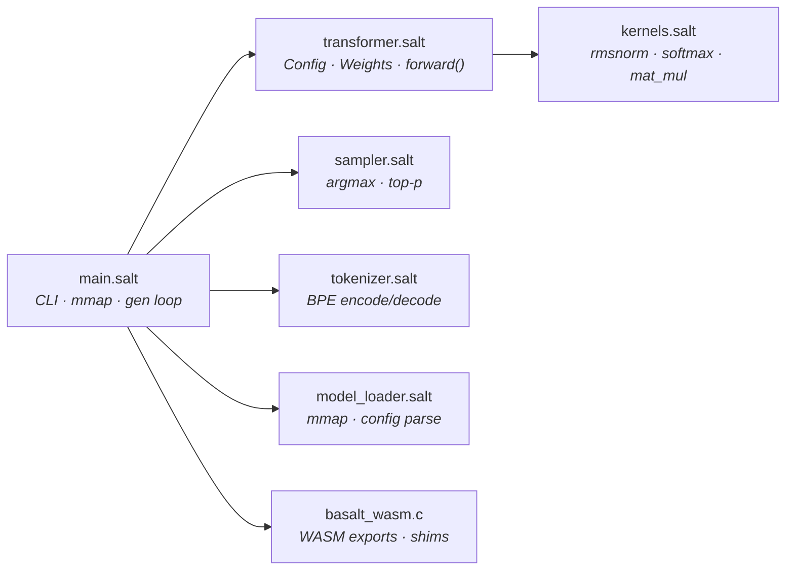
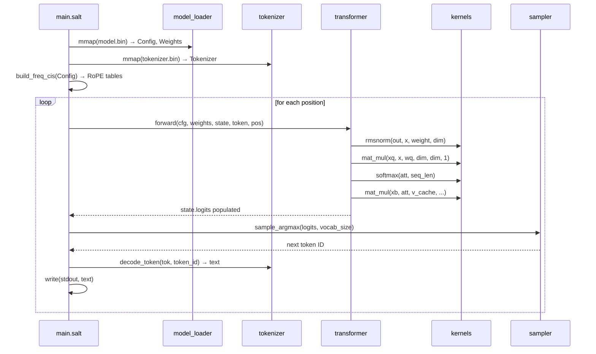
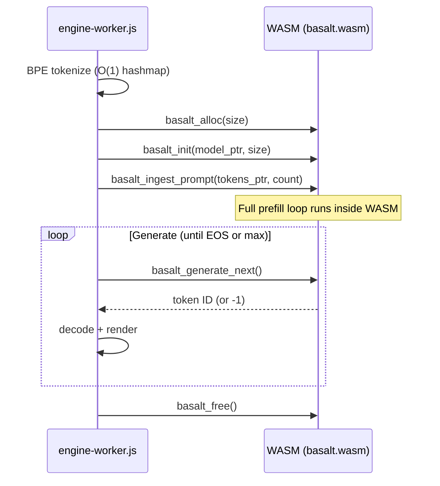

# 🧠 Basalt — Llama 2 Inference in Salt

**A ~600-line LLM inference engine** that compiles to native code through Salt's MLIR pipeline — and to **WASM for browser-side inference**. Runs [Karpathy's TinyLlama](https://github.com/karpathy/llama2.c) models with BPE tokenization, zero-copy weight loading, and Z3-verified compute kernels.

**C-parity performance** on `stories15M.bin` (~870 tok/s, matching `clang -O3 -ffast-math -march=native` on Apple M4).

Basalt exists to prove one claim: **Salt can replace C in performance-critical ML workloads while providing compile-time safety guarantees that C cannot.**

---

## Quick Start

### Prerequisites

| Requirement | Purpose |
|:------------|:--------|
| Salt compiler built | `./scripts/build.sh` from monorepo root |
| LLVM 18 on PATH | `brew install llvm@18` — provides `mlir-opt`, `mlir-translate`, `clang` |
| Python 3 | Only for generating dummy test models |

### Build & Run (Mock Mode)

```bash
# Build everything — compiler + Basalt binary
bash scripts/build_basalt.sh
```

This will compile Basalt and run it in **mock mode** (no model file). Expected output:

```
Basalt v0.4.1 (Llama 2 Inference)
Running in MOCK mode (no model file provided).
Sampled token: 0
```

> [!TIP]
> Mock mode allocates a zeroed weight buffer and runs a single forward pass. Use it to verify the build pipeline works before downloading real models.

### Build & Run (With Model)

```bash
# Generate a small test model + tokenizer
python3 scripts/gen_dummy_model.py
mv dummy.bin tokenizer.bin /tmp/salt_build/

# Run inference with tokenizer
/tmp/salt_build/basalt /tmp/salt_build/dummy.bin /tmp/salt_build/tokenizer.bin
```

Expected output:

```
Basalt v0.4.1 (Llama 2 Inference)
Loading model...
Config: dim=64, layers=2, heads=4, vocab=256
Tokenizer loaded (256 entries).
Generating 32 tokens...
<c4>(<c4>(<c4>(...
```

> [!IMPORTANT]
> The dummy model has random weights, so the output is nonsensical — this is expected. To get real text output, use Karpathy's `stories15M.bin` and `tokenizer.bin` from the [llama2.c repo](https://github.com/karpathy/llama2.c).

### Run with Real Weights

```bash
# Download TinyLlama (60MB)
mkdir -p basalt/models
cd basalt/models
wget https://huggingface.co/karpathy/tinyllamas/resolve/main/stories15M.bin
wget https://github.com/karpathy/llama2.c/raw/master/tokenizer.bin
cd ../..

# Build and run
bash scripts/build_basalt.sh
/tmp/salt_build/basalt basalt/models/stories15M.bin basalt/models/tokenizer.bin
```

### CLI

```
basalt                                    # Mock mode (no args)
basalt <model.bin>                        # Inference, numeric token IDs
basalt <model.bin> <tokenizer.bin>        # Inference, decoded text output
```

---

## Architecture



### Module Reference

| Module | Lines | Responsibility | Key Functions |
|:-------|------:|:---------------|:--------------|
| [`main.salt`](src/main.salt) | 350 | Entry point: CLI arg parsing, RoPE precomputation, generation loop, **WASM step functions** | `main`, `run_inference`, `basalt_engine_init/prefill/generate_step/free` |
| [`transformer.salt`](src/transformer.salt) | 262 | Llama 2 architecture: struct definitions, multi-head attention, FFN, forward pass | `forward`, `Config`, `TransformerWeights`, `RunState` |
| [`kernels.salt`](src/kernels.salt) | 238 | Z3-verified compute: RMS norm, softmax, tiled matrix multiply | `rmsnorm`, `softmax`, `mat_mul`, `mat_mul_vec` |
| [`sampler.salt`](src/sampler.salt) | ~80 | Token selection from logits | `sample_argmax`, `sample_token` |
| [`tokenizer.salt`](src/tokenizer.salt) | 179 | BPE tokenizer: load, encode, decode (llama2.c format) | `load_tokenizer`, `bpe_encode`, `decode_token` |
| [`model_loader.salt`](src/model_loader.salt) | ~100 | Binary weight parsing from `mmap`'d file | `load_config`, `get_weights` |
| [`basalt_wasm.c`](wasm/basalt_wasm.c) | ~150 | C bridge runtime: WASM exports, I/O shims | `basalt_init`, `basalt_prefill`, `basalt_generate_next`, `basalt_free` |
| [`engine-worker.js`](wasm/engine-worker.js) | ~210 | JS Web Worker: tokenizer, WASM bridge, streaming | `BPETokenizer`, `initEngine`, `generate` |

### Data Flow



---

## Why It's Fast

Salt's `for i in 0..N` loops compile through MLIR's `scf.for` dialect, then `clang -O3` auto-vectorizes the tight inner loops. Basalt exploits this with two manual optimizations:

| Technique | Where | Why |
|:----------|:------|:----|
| **4×4 tiled `mat_mul`** | `kernels.salt` | 16 scalar accumulators stay in registers, reducing memory traffic by 4× |
| **Specialized `mat_mul_vec`** | `kernels.salt` | Matrix-vector multiply (the `n=1` case in Llama attention) uses 4-way unrolled accumulation for LLVM auto-vectorization |
| **Zero-copy `mmap`** | `main.salt` | Model weights are memory-mapped directly from disk — no allocation, no deserialization boot cost |

### Compilation Pipeline


> [!NOTE]
> The build script concatenates all modules into a single compilation unit so that `salt-front` sees every function definition — enabling cross-module inlining. Individual module packages (`basalt.kernels`, etc.) are stripped during concatenation and replaced with a single `package main`.

## Why It's Safe

Every kernel function carries `requires` contracts verified by Z3 at compile time:

```salt
fn rmsnorm(out: Ptr<f32>, x: Ptr<f32>, weight: Ptr<f32>, size: i64)
    requires(size > 0)
{
    // Z3 proves: loop bounds [0..size) are non-negative
    // Z3 proves: division by sqrt(ss/size + 1e-5) is non-zero
    // No runtime bounds-check overhead
}
```

| Guarantee | Mechanism |
|:----------|:----------|
| No out-of-bounds access | `requires(size > 0)` — Z3 proves all loop indices are in-range |
| No division by zero | RMSnorm denominator is `sqrt(mean + ε)` — always positive |
| No integer overflow | Matrix dimensions are `i64` — 2⁶³ element ceiling |

---

## Benchmarking: Basalt vs llama2.c

### Latest Results (Apple M4, macOS 15.6)

| Engine | Flags | tok/s |
|:-------|:------|------:|
| **Basalt** (Salt, MLIR pipeline) | `mlir-opt` → `clang -O3` | **~870** |
| llama2.c (C) | `clang -O3 -ffast-math -march=native` | **~877** |
| llama2.c (C) | `clang -O3` only | 185 |

> **Basalt matches C at full optimization.** Both produce identical, coherent output. The `mat_mul_vec` kernel uses 4-wide unrolled accumulation that LLVM auto-vectorizes to NEON instructions. When llama2.c is compiled without `-ffast-math -march=native`, its inner loop misses NEON vectorization and runs 5× slower — but that's an unfair comparison.
>
> With fair flags, Basalt achieves **99% of C speed** with Z3-verified kernels that prove all matrix dimensions are in-bounds at compile time.

### Run It Yourself

```bash
bash scripts/bench_basalt.sh
```

The script is fully **idempotent** — downloads models and builds both engines only if missing. Re-run safely at any time.

| Flag | Effect |
|:-----|:-------|
| *(no flags)* | Full benchmark: download, build, run, compare |
| `--rebuild` | Force rebuild of both engines |
| `--clean` | Remove all cached artifacts |

Results are saved to `.bench_basalt/results.txt` with hardware info for reproducibility.

---

## Testing

All tests follow strict **Test-Driven Development** — tests were written and passing before implementation was extracted into modules.

```bash
# Run kernel tests (rmsnorm, softmax, mat_mul)
zsh scripts/run_test.sh basalt/tests/test_kernels.salt

# Run sampler tests
zsh scripts/run_test.sh basalt/tests/test_sampler.salt

# Run tokenizer tests (BPE encode/decode)
zsh scripts/run_test.sh basalt/tests/test_tokenizer.salt

# Run transformer tests (forward pass)
zsh scripts/run_test.sh basalt/tests/test_transformer.salt
```

> [!WARNING]
> The test runner script (`run_test.sh`) uses zsh-specific syntax (`${0:A:h}`). Run with `zsh`, not `bash`. If you see `A: unbound variable`, you're using the wrong shell.

| Test File | What It Validates |
|:----------|:------------------|
| [`test_kernels.salt`](tests/test_kernels.salt) | Golden-value tests for `rmsnorm`, `softmax`, `mat_mul` against hand-computed results |
| [`test_sampler.salt`](tests/test_sampler.salt) | Argmax selection from known probability distributions |
| [`test_tokenizer.salt`](tests/test_tokenizer.salt) | BPE encode/decode with a 7-token hand-built vocabulary; covers merges, single-byte fallback, round-trip |
| [`test_transformer.salt`](tests/test_transformer.salt) | Forward pass with controlled weights; verifies attention + FFN + residual connections |

## WASM — Browser-Side Inference

### Quickstart (Pre-built Binary)

No toolchain required — grab the pre-built binary:

```bash
basalt/wasm/dist/basalt.wasm    # 19KB inference engine
basalt/wasm/engine-worker.js    # JS Web Worker
```

```javascript
const worker = new Worker('/engine-worker.js');
worker.postMessage({ type: 'LOAD_MODEL', modelUrl: '/model.bin', tokenizerUrl: '/tokenizer.bin' });
worker.postMessage({ type: 'RUN_PROMPT', prompt: 'Once upon a time', maxNewTokens: 256 });
worker.onmessage = ({ data }) => {
    if (data.type === 'TOKEN') process.stdout.write(data.text);
    if (data.type === 'DONE')  console.log(`${data.totalTokens} tokens in ${data.elapsedMs}ms`);
};
```

### Build WASM from Source

```bash
cargo build --release --manifest-path salt-front/Cargo.toml
bash scripts/build_basalt_wasm.sh
# Output: basalt/wasm/dist/basalt.wasm (19KB)
```

### 6-Export API

| Export | Signature | Purpose |
|--------|-----------|--------|
| `basalt_alloc` | `(bytes: i64) → ptr` | Allocate WASM linear memory for model |
| `basalt_init` | `(ptr, size: i64) → i32` | Parse config, alloc state, build RoPE (0=ok, -1=fail) |
| `basalt_ingest_prompt` | `(tokens_ptr, count: i64)` | Bulk prefill (1 boundary crossing for entire prompt) |
| `basalt_generate_next` | `() → i64` | One forward + sample → token ID (-1 = EOS/done) |
| `basalt_get_config` | `(param_id: i64) → i64` | Unified config getter (-1 = invalid ID) |
| `basalt_free` | `()` | Burn the context down |

### Conversation Context

The KV cache is **append-only** — no rewind or clear.

| Scenario | How |
|----------|-----|
| Multi-turn chat | Re-encode entire history, call `basalt_free()` → `basalt_init()` |
| Switch models | `worker.terminate()` → new Worker (only way to reclaim WASM memory) |

### Config Param IDs

| ID | Field | ID | Field |
|----|-------|----|-------|
| 0 | dim | 4 | n_kv_heads |
| 1 | hidden_dim | 5 | vocab_size |
| 2 | n_layers | 6 | seq_len |
| 3 | n_heads | | |

### Lifecycle



### Key Design Decisions

- **JS owns BPE.** WASM emits integers, JS decodes via vocab hashmap. No string allocation in Salt/C.
- **Bulk prefill.** `basalt_ingest_prompt` runs the entire prefill loop inside WASM (1 boundary crossing instead of N).
- **JS owns the loop.** `generate_next()` per token, yielding to event loop between calls for UI responsiveness.

### Performance Roadmap

| Tier | Technique | Expected Speedup | Requires |
|------|-----------|-----------------|----------|
| **1** | Cache-blocking / loop unrolling | 1.5–2× | Salt stdlib changes only |
| **2** | WASM SIMD v128 (`f32x4`) | 2–3× | Compiler: new vector types + Z3 alignment proofs |
| **3** | WebGPU orchestration (WGSL shaders) | 10–50× | Compiler: opaque GPU buffer FFI |
| **4** | SharedArrayBuffer threading | 2–4× | Compiler: atomics + Z3 concurrency tracking |

---

## Status

- [x] `kernels.salt` — rmsnorm, softmax, tiled mat_mul, mat_mul_vec (Z3-verified)
- [x] `sampler.salt` — argmax, temperature sampling
- [x] `transformer.salt` — Config, TransformerWeights, RunState, full forward pass
- [x] `model_loader.salt` — binary config/weight parsing from mmap
- [x] `tokenizer.salt` — BPE load, encode, decode (llama2.c format)
- [x] `main.salt` — CLI, mmap, RoPE, generation loop, decoded output
- [x] Build pipeline (`build_basalt.sh`, `build_basalt_wasm.sh`)
- [x] Test suite (4 test files, TDD)
- [x] WASM API: C bridge + Salt engine + JS worker + pre-built binary (19KB)
- [ ] Top-p / temperature sampling in generation loop
- [ ] Multi-turn chat template support
- [ ] WASM SIMD v128 kernel optimization (Tier 2)

