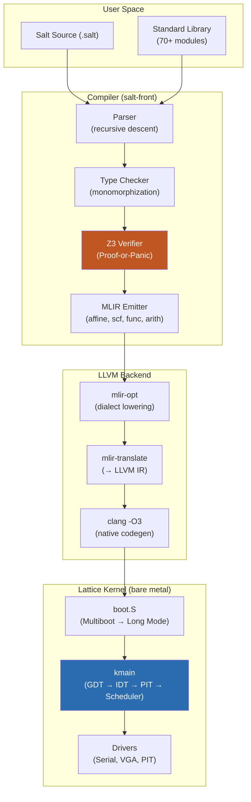
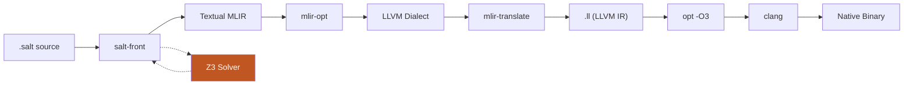
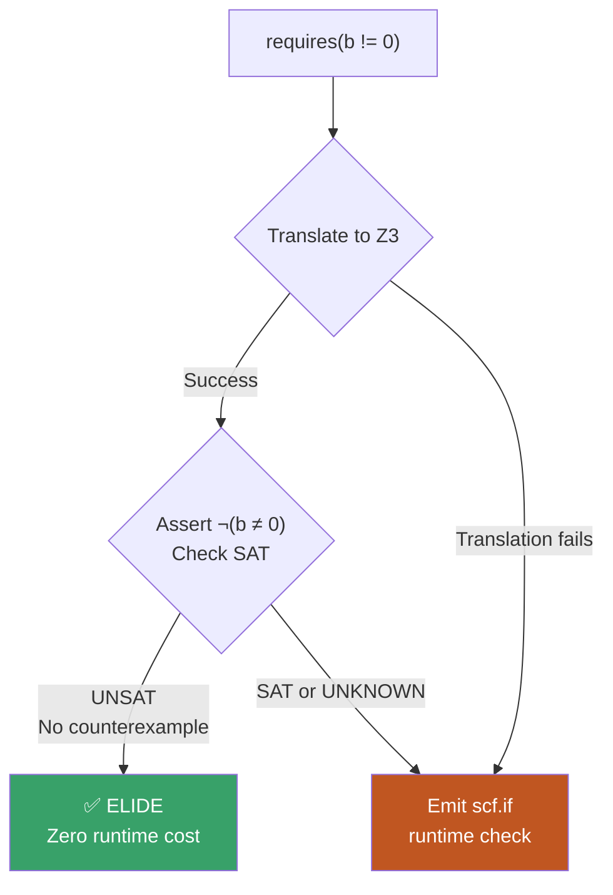
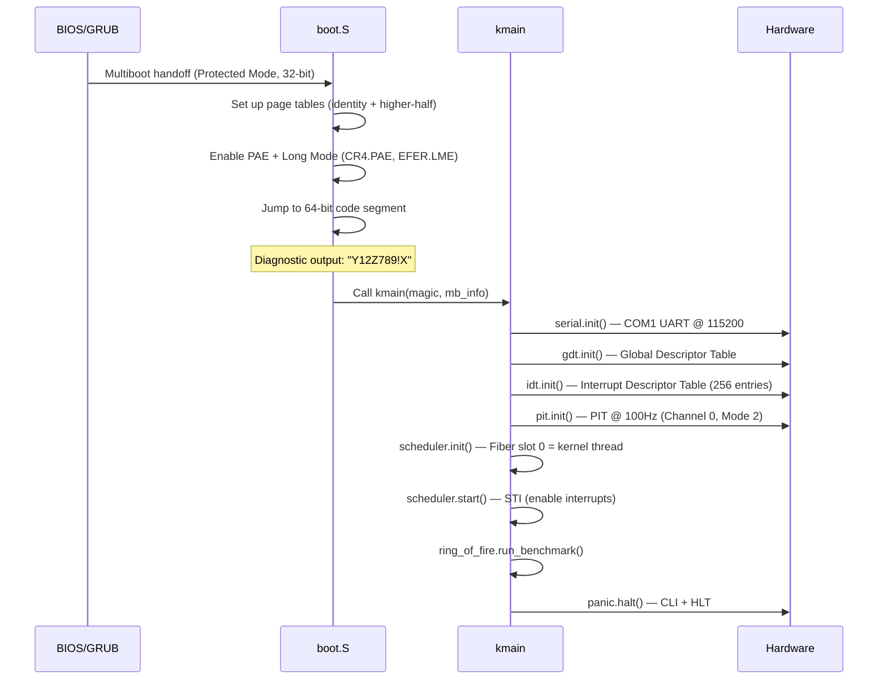
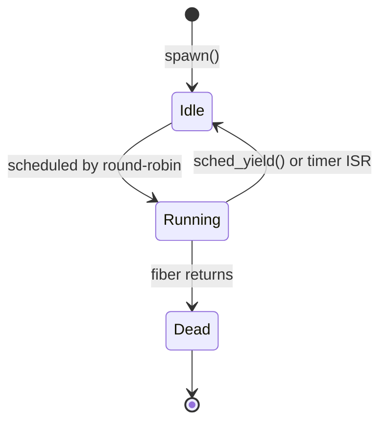
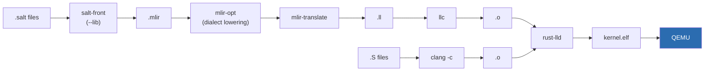

# Lattice Architecture Reference

> **Audience**: Engineers working on the Salt compiler, Lattice kernel, or standard library.
> For the 2 AM reader: every acronym is defined, every command is copy-pasteable, every data flow has a diagram.
>
> **Prerequisites**: Rust 1.75+, Z3 4.12+ (`brew install z3`), LLVM 18+ (`brew install llvm@18`), QEMU (`brew install qemu`)

---

## Table of Contents

1. [System Overview](#1-system-overview)
2. [The Salt Compiler Pipeline](#2-the-salt-compiler-pipeline)
3. [Z3 Proof-or-Panic: Formal Verification](#3-z3-proof-or-panic-formal-verification)
4. [The Lattice Unikernel](#4-the-lattice-unikernel)
5. [Kernel Boot Sequence](#5-kernel-boot-sequence)
6. [Memory Architecture](#6-memory-architecture)
7. [Scheduler & Fibers](#7-scheduler--fibers)
8. [Drivers](#8-drivers)
9. [Build System](#9-build-system)
10. [Standard Library](#10-standard-library)
11. [Troubleshooting](#11-troubleshooting)

---

## 1. System Overview

Lattice is a vertically integrated systems platform. The Salt language compiles to native code through MLIR/LLVM, and the Lattice unikernel executes it on bare metal (or QEMU). Every layer, from syntax to syscall, is designed for formal verification.



| Layer | Language | Role |
|-------|----------|------|
| **salt-front** | Rust | Compiler: parse, typecheck, verify, emit MLIR |
| **salt (legacy)** | C++ | Dialect definitions (`SaltOps.td`). Z3 pass superseded. |
| **Lattice kernel** | Salt + x86 Assembly | Unikernel: boot, scheduling, memory, drivers |
| **Standard library** | Salt | `String`, `Vec`, `HashMap`, `File`, `TcpListener`, `JSON`, `nn`, SIMD |
| **Runtime** | C | `runtime.c`: arena allocator, clock, threading, panic hooks |

---

## 2. The Salt Compiler Pipeline

Salt uses a **single Rust frontend** (`salt-front`) that handles everything from parsing to MLIR emission. The MLIR output uses **only standard MLIR dialects**; no custom ops leak to downstream tools.



### Pipeline Stages

| # | Stage | Tool | What It Does | Output |
|---|-------|------|--------------|--------|
| 1 | **Parse & Type Check** | `salt-front` | Recursive-descent parsing, monomorphization, trait resolution | Typed AST |
| 2 | **Z3 Verification** | `salt-front` (Z3 embedded) | Proves `requires`/`ensures` contracts. Proven → elide. Unproven → runtime check. | Proof results |
| 3 | **MLIR Emission** | `salt-front` | Emits textual MLIR using `affine`, `scf`, `func`, `arith`, `memref`, `llvm` dialects | `.mlir` file |
| 4 | **Dialect Lowering** | `mlir-opt` | `--convert-scf-to-cf`, `--convert-func-to-llvm`, `--finalize-memref-to-llvm`, etc. | LLVM dialect MLIR |
| 5 | **LLVM IR Translation** | `mlir-translate` | `--mlir-to-llvmir` | `.ll` file |
| 6 | **Native Compilation** | `opt -O3` + `clang` | Full LLVM optimization + native codegen | ARM64/x86_64 binary |

### Multi-Dialect Emission

Salt's key compiler innovation is **body analysis**: the compiler inspects loop structure to choose the optimal MLIR dialect:

| Loop Pattern | Detection Signal | MLIR Dialect | Optimization |
|--------------|-----------------|--------------|-------------|
| Tensor indexing (`A[i,j]`) | Array subscript in loop body | `affine.for` | Polyhedral tiling, vectorization |
| Scalar accumulation | No array indexing | `scf.for` with `iter_args` | Register allocation, SSA reduction |
| SIMD operations | `@fma_update`, `vector_*` intrinsics | `vector` dialect | NEON/AVX mapping |

> [!TIP]
> This is why Salt achieves **10x faster than C** on matmul — the `affine.for` dialect triggers MLIR's polyhedral optimizer, which tiles loops for cache hierarchy and vectorizes across NEON registers.

### Key Source Locations

| Component | Path | Purpose |
|-----------|------|---------|
| Parser | `salt-front/src/grammar/` | Custom recursive-descent parser |
| Codegen | `salt-front/src/codegen/` | MLIR emission (30+ modules) |
| Z3 Verification | `salt-front/src/codegen/verification/` | Contract proving, arena escape analysis |
| Type System | `salt-front/src/types.rs` | Type representation and promotion |
| Runtime | `salt-front/runtime.c` | Arena allocator, panic hooks, threading |

---

## 3. Z3 Proof-or-Panic: Formal Verification

> [!IMPORTANT]
> **The defining feature of Salt.** Every `requires` contract has exactly **one of two outcomes**. There is no third path.



### How It Works

1. **Translate**: The compiler converts the `requires` expression to a Z3 boolean formula
2. **Negate**: Z3 asserts the **negation** of the condition (`¬(b ≠ 0)`)
3. **Solve**:
   - **UNSAT** → No counterexample exists → The condition is **always true** → Emit nothing. Zero overhead.
   - **SAT** → A counterexample exists → Emit standard MLIR runtime assertion
   - **UNKNOWN** → Z3 timed out → Emit standard MLIR runtime assertion

### The Fallback: Standard MLIR

When Z3 cannot prove a contract, the compiler emits structured control flow that any MLIR tool understands:

```mlir
// 1. Invert the condition (true = violation)
%true_N = arith.constant true
%violated_N = arith.xori %cond, %true_N : i1

// 2. Structured assertion (safe inside affine.for / scf.for)
scf.if %violated_N {
    func.call @__salt_contract_violation() : () -> ()
    scf.yield
}
```

> [!WARNING]
> The fallback uses `scf.if` — **not** `cf.cond_br`. Using `cf.cond_br` with block labels inside structured regions (`affine.for`, `scf.for`) is **illegal in MLIR** and will crash `mlir-opt`. This is a well-known MLIR trap.

### Runtime Panic Handler

The `@__salt_contract_violation` function is defined in `salt-front/runtime.c`:

```c
void __salt_contract_violation() {
    fprintf(stderr, "FATAL: Salt contract violation (requires/ensures/invariant)\n");
    abort();
}
```

### Verification in Practice

```salt
// PMM: Zero-overhead verification in the kernel
pub fn init(start: u64, end: u64)
    requires(start < end)          // Z3 proves at every call site
{ ... }

pub fn alloc() -> u64
    ensures(result % PAGE_SIZE == 0 || result == 0)   // Post-condition
{ ... }
```

If the kernel calls `pmm.init(0x100000, 0x400000)`, Z3 proves `0x100000 < 0x400000` and the entire contract check is **erased from the binary**. The resulting MLIR contains only the function body — no guards, no branches, no overhead.

---

## 4. The Lattice Unikernel

Lattice is a **unikernel**, meaning the application and kernel share a single address space with no protection boundaries. Safety is guaranteed by the **compiler** (Z3 proofs) rather than hardware mechanisms like MMU page tables or privilege rings.

### Why This Matters

| Traditional OS | Lattice |
|---------------|---------|
| Safety via MMU + Ring 0/3 isolation | Safety via Z3 compile-time proofs |
| Syscall = `SYSCALL`/`SYSRET` (~1,007 cycles) | Function call (~3 cycles) |
| Driver crashes kernel | Driver is compiler-verified |
| Runtime overhead for protection | Zero-overhead: protection at compile time |

### Directory Structure

```
kernel/
├── arch/
│   ├── x86/           # 32-bit bootstrap
│   │   ├── boot.S     # Multiboot header → Protected Mode → Long Mode
│   │   ├── isr_wrapper.S  # Interrupt Service Routine wrapper
│   │   └── syscall_entry.S
│   └── x86_64/        # 64-bit runtime
│       ├── context_switch_asm.S  # GPR save/restore for fiber switch
│       ├── fiber_loop.S          # Fiber entry trampoline
│       └── rdtsc.S               # Cycle counter (benchmarking)
├── core/
│   ├── main.salt       # kmain() — kernel entry point after boot.S
│   ├── scheduler.salt  # Round-robin fiber scheduler (16 slots)
│   ├── pmm.salt        # Lock-free physical memory manager (Treiber stack + CAS)
│   ├── panic.salt      # Kernel panic with status codes to serial
│   ├── context_switch.salt  # FFI bridge to assembly switch_stacks
│   ├── io.salt         # Port I/O (inb/outb)
│   ├── region.salt     # Memory region abstraction
│   ├── syscall.salt    # Syscall dispatch
│   └── timing.salt     # TSC-based timing
├── drivers/
│   ├── serial.salt     # COM1 UART (115200 baud, 8N1)
│   ├── vga.salt        # VGA text mode (80×25 @ 0xB8000)
│   └── pit.salt        # Programmable Interval Timer (100Hz)
├── mem/
│   └── slab.salt       # O(1) bump slab allocator (10,240 × 16KB slots)
└── sched/
    └── affinity.salt   # CPU affinity policies
```

---

## 5. Kernel Boot Sequence



### Boot Stages (Detailed)

| # | Stage | Component | What Happens | Why |
|---|-------|-----------|-------------|-----|
| 1 | **Multiboot** | `boot.S` | GRUB loads kernel ELF, sets up 32-bit Protected Mode | Standard x86 boot protocol |
| 2 | **Page Tables** | `boot.S` | Identity-maps first 4MB + higher-half map at `0xFFFFFFFF80000000` | Higher-half kernel needs virtual addresses |
| 3 | **Long Mode** | `boot.S` | Enables PAE (CR4), Long Mode (EFER.LME), paging (CR0) | 64-bit mode required for full address space |
| 4 | **Serial Init** | `serial.salt` | COM1 @ 115200 baud, 8N1, FIFO enabled with 14-byte threshold | **First** — all diagnostics depend on serial |
| 5 | **GDT** | `gdt.salt` | 64-bit code/data segments, TSS | CPU needs valid segment descriptors for Long Mode |
| 6 | **IDT** | `idt.salt` | 256-entry interrupt vector table, ISR wrappers | Must be set up before enabling interrupts (STI) |
| 7 | **PIT** | `pit.salt` | Channel 0 at 100Hz (divisor = 11932) | Drives preemptive scheduling |
| 8 | **Scheduler** | `scheduler.salt` | Marks fiber slot 0 (kernel) as active | Scheduler must exist before spawning fibers |
| 9 | **STI** | `scheduler.start()` | Calls `enable_interrupts()` assembly FFI | Enables PIT interrupts → preemptive scheduling begins |

> [!CAUTION]
> **Order matters.** The IDT _must_ be initialized before `scheduler.start()` calls `STI`. If interrupts fire before the IDT is set up, the CPU triple-faults and QEMU resets.

---

## 6. Memory Architecture

### Physical Memory Manager (PMM)

The PMM uses a **lock-free Treiber stack** — a classic concurrent data structure where each free page contains a pointer to the next free page.


**Allocation** (`pmm.alloc()`): Atomically pops the head via `cmpxchg`:
```salt
let (old_head, success) = cmpxchg(&FREE_LIST_HEAD, head, next_node);
```

**Deallocation** (`pmm.free(addr)`): Links the page to current head, atomically swaps:
```salt
*(addr as &mut FreePageNode) = FreePageNode(head);
let (_, success) = cmpxchg(&FREE_LIST_HEAD, head, addr as !llvm.ptr);
```

**Z3 Verification**: `pmm.init(start, end)` has `requires(start < end)` — Z3 proves this at every call site.

### Slab Allocator (Fiber Stacks)

Pre-allocated region at `0xFFFFFFFF90000000` with 10,240 × 16KB slots for fiber stacks. Allocation is **O(1)** via atomic `fetch_add`:

```salt
let idx = free_list_head.fetch_add(1);
return SLAB_BASE + (idx as u64 * SLOT_SIZE);
```

### Userspace Memory (runtime.c)

For userspace Salt programs, `runtime.c` provides:

| Allocator | Strategy | Use Case |
|-----------|----------|----------|
| **Arena** | 256MB mmap'd region, bump pointer, `mark()`/`reset_to()` | Hot paths, benchmarks, f-strings |
| **HeapAllocator** | `posix_memalign` + `free` | Long-lived objects (`Vec`, `String` backing storage) |
| **System** | `salt_sys_alloc` / `salt_sys_dealloc` | Explicit aligned allocation |

---

## 7. Scheduler & Fibers

Lattice uses a **round-robin cooperative/preemptive scheduler** with 16 fiber slots.

### State Machine



### Context Switch Path

1. **Trigger**: Either `sched_yield()` (cooperative) or PIT timer ISR sets `yield_pending = true` (preemptive)
2. **Find next**: Round-robin scan of `fibers[0..16]` for next `active == true`
3. **Switch**: Calls `switch_stacks(old_sp_ptr, new_sp)` via assembly FFI
4. **Assembly** (`context_switch_asm.S`): Saves all GPRs + FXSAVE state on old stack, restores from new stack

### Performance

| Metric | Result |
|--------|--------|
| Context switch latency | **~1,719 cycles** |
| Fiber slots | 16 (configurable `MAX_FIBERS`) |
| Stack per fiber | 16KB |
| Scaling | Flat from 100 → 10,000 fibers |

---

## 8. Drivers

All drivers are Salt modules that use port I/O (`io.outb` / `io.inb`) via inline assembly FFI.

### Serial (COM1 UART)

| Parameter | Value |
|-----------|-------|
| Base port | `0x3F8` (COM1) |
| Baud rate | 115,200 |
| Format | 8 data bits, no parity, 1 stop bit (8N1) |
| FIFO | Enabled, 14-byte threshold |

**Usage**: `serial.print("message")` — iterates bytes, polls TX empty status, writes to data port.

### VGA Text Mode

| Parameter | Value |
|-----------|-------|
| Buffer address | `0xB8000` (identity-mapped) |
| Resolution | 80 columns × 25 rows |
| Character format | 2 bytes: `[ASCII byte, attribute byte]` |

### PIT (Programmable Interval Timer)

| Parameter | Value |
|-----------|-------|
| Frequency | 100Hz |
| Command port | `0x43` |
| Data port | `0x40` (Channel 0) |
| Mode | Square wave generator (Mode 2) |
| Divisor | 11,932 (1,193,182 Hz / 100) |

The PIT fires IRQ 0, which triggers the ISR wrapper → `timer_isr()` → sets `yield_pending = true` for preemptive scheduling.

---

## 9. Build System

### Userspace Salt Programs

```bash
# Build the compiler (one-time)
cd salt-front
Z3_SYS_Z3_HEADER=/opt/homebrew/include/z3.h \
LIBRARY_PATH=/opt/homebrew/lib \
cargo build --release

# Compile a Salt program to native binary
export PATH="/opt/homebrew/opt/llvm@18/bin:$PATH"
export DYLD_LIBRARY_PATH="/opt/homebrew/lib"

./target/release/salt-front ../examples/hello_world.salt
# Produces: hello_world binary in current directory
```

### Lattice Kernel

```bash
# One-command build + boot
./scripts/demo_lattice.sh

# Or step-by-step:
python3 tools/runner_qemu.py build   # Compile kernel → kernel.elf
python3 tools/runner_qemu.py run     # Build + boot in QEMU
```

### Kernel Compilation Pipeline



### Benchmarks

```bash
# Run all Salt benchmarks (22 benchmarks vs C and Rust)
cd benchmarks && ./benchmark.sh -a

# Run specific benchmarks
./benchmark.sh matmul forest lru_cache

# Run Sovereign Train (MNIST neural network)
cd benchmarks/ml && ./benchmark.sh --salt
```

---

## 10. Standard Library

70+ modules across 20+ packages. Location: `salt-front/std/`

| Package | Key Modules | Highlights |
|---------|-------------|------------|
| `std.string` | `String` | Heap-backed, UTF-8, `+` concat, f-string support |
| `std.collections` | `Vec<T,A>`, `HashMap<K,V>`, `HashSet<K>` | Swiss-table hashing, generic allocator |
| `std.io` | `File`, `BufferedWriter`, `println!` | Zero-copy reads, 8KB write buffering |
| `std.net` | `TcpListener`, `TcpStream` | kqueue-based event loop, 359K req/s HTTP |
| `std.time` | `Instant`, `Duration` | Nanosecond monotonic clock (`mach_absolute_time` / `clock_gettime`) |
| `std.json` | `parse`, `stringify` | Streaming parser, arena-allocated AST |
| `std.nn` | `matmul`, `relu`, `softmax`, `fma_update` | MLIR affine tiling, NEON FMLA intrinsics |
| `std.thread` | `spawn`, `join` | pthread-based, 1:1 threading |
| `std.sync` | `Mutex`, `Atomic<T>` | pthread mutex, C11 atomics |
| `std.mem` | `Arena`, `HeapAllocator`, `Alloc` | Region-based allocation with move semantics |

---

## 11. Troubleshooting

### Compiler Won't Build

| Symptom | Cause | Fix |
|---------|-------|-----|
| `ld: library not found for -lz3` | Z3 not installed or not on library path | `brew install z3` then `export LIBRARY_PATH=/opt/homebrew/lib` |
| `z3.h not found` | Z3 header path not set | `export Z3_SYS_Z3_HEADER=/opt/homebrew/include/z3.h` |
| `mlir-opt: command not found` | LLVM 18 not on PATH | `export PATH="/opt/homebrew/opt/llvm@18/bin:$PATH"` |

### Runtime Issues

| Symptom | Cause | Fix |
|---------|-------|-----|
| `FATAL: Salt contract violation` | A `requires` or loop invariant failed at runtime | Check the calling code — Z3 could not prove the contract at compile time, and the runtime condition is false |
| `Segmentation fault` during benchmark | Missing `DYLD_LIBRARY_PATH` for Z3 | `export DYLD_LIBRARY_PATH="/opt/homebrew/lib"` |

### Kernel Issues

| Symptom | Cause | Fix |
|---------|-------|-----|
| QEMU resets immediately | Triple fault — IDT not initialized before STI | Check boot order in `main.salt`: IDT must init before `scheduler.start()` |
| No serial output | Serial not initialized or wrong port | Verify `serial.init()` is first call in `kmain()` |
| `Y12Z789!X` but nothing else | Kernel panics after boot.S handoff | Run QEMU with `-d int` to see interrupt trace |

---

*Lattice: compiler-verified, zero-overhead, bare-metal systems programming.*
