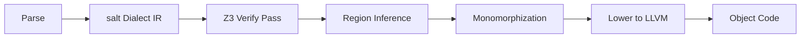

# Salt Language & Compiler Specification

> **Version**: 2.0 (February 2026)
> **Canonical Syntax Reference**: [SYNTAX.md](../SYNTAX.md)

---

## 1. The Salt Language (User-Facing)

### 1.1 Core Paradigm
**Systems Programming with Formal Verification**

* **Immutability by default:** `let` for immutable bindings, `let mut` for mutable.
* **No Exceptions:** Errors are values (`Result<T>` with `Status`). Use `|?>` or `?` to propagate.
* **Explicit return:** Every function with a return type uses `return`.

### 1.2 Syntax & Ergonomics

| Feature | Syntax | Rationale |
| :--- | :--- | :--- |
| **Mandatory Parens** | `print("hello")` | Removes parsing ambiguity. |
| **Pipeline** | `x \|> f()` | Sugar for `f(x)`. Enables "Reading Left-to-Right". |
| **Railway Pipe** | `x \|?> f()` | Sugar for `match x { Ok(v) -> f(v), Err(e) -> Err(e) }`. |
| **Contracts** | `requires(x > 0)` | Formal verification assertions proven by Z3. |

> **Full syntax reference**: types, control flow, traits, enums, pattern matching, sugar, and stdlib imports are maintained in [SYNTAX.md](../SYNTAX.md).

### 1.3 Memory Model
**Region-Based Allocation with Move Semantics**

* **No GC:** Memory is not traced.
* **Arena allocation:** The primary allocation strategy is `Arena`: scoped bump allocation with O(1) bulk free via `mark()`/`reset_to()`.
* **HeapAllocator:** For long-lived data that outlives a single scope, `HeapAllocator` wraps platform `malloc`/`free` behind a safe API.
* **Move Semantics:** Passing a value to a function *moves* it. The caller loses ownership. Use-after-move is a compile-time error.

### 1.4 Type System

- **ADTs**: `enum Shape { Circle(f32), Rect(f32, f32) }`
- **Exhaustive Matching**: `match` must handle every case
- **No Null**: Strict `Option<T>` and `Result<T>`
- **Traits**: `Clone`, `Eq`, `Hash`, `Ord` (derivable via `@derive`)
- **Generics**: Full monomorphization with multi-parameter support (`Vec<T, A>`)
- **Function Pointers**: `fn(u64, u64) -> u64` — first-class types for dispatch tables, IDT vectors, and indirect calls

### 1.5 Verification (The "High Ground")

```salt
fn safe_div(a: i32, b: i32) -> i32
    requires(b != 0)
    ensures(result * b == a)
{
    return a / b;
}
```

- **Contracts**: Native `requires(bool)` and `ensures(bool)`
- **Design by Contract**: Compiler proves safety *before* code runs via Z3
- **Zero-overhead verification**: Z3 proves contracts at compile time; proven conditions are fully elided. Unproven conditions emit standard MLIR runtime assertions (`scf.if` + panic)

---

## 2. The MLIR Backend (Compiler-Facing)

### 2.1 The `salt` Dialect
The Intermediate Representation bridging Salt source and LLVM IR.

| Operation | Purpose | Lowering Strategy |
| :--- | :--- | :--- |
| `salt.func` | Function def | Inject implicit `%region` argument. |
| *(removed)* | ~~`salt.verify`~~ | Replaced by Z3 Proof-or-Panic: proven contracts are elided; unproven lower to `scf.if` + `@__salt_contract_violation`. |
| `salt.call` | Function call | Forward current `%region` to callee. |
| `salt.region_alloc` | Allocation | Lower to `llvm.alloca` (Stack) or Ptr Increment (Heap). |
| `salt.match` | Pattern Matching | Lower to `scf.if` tree or `cf.switch`. |
| `salt.asm` | Inline Assembly | Lower to `llvm.inline_asm` (for Kernel Ops). |
| `salt.panic` | Abort execution | Lower to trap intrinsic. |
| `salt.constant` | Typed literal | Lower to `arith.constant`. |

### 2.2 The Verification Pipeline



| Pass | Responsibility |
|------|----------------|
| **Z3 Verify** | Inter-procedural contract checking |
| **Region Inference** | Escape analysis → stack vs heap |
| **Monomorphization** | Generic instantiation |

### 2.3 Standard Dialects Used

- **`arith`**: Integer/float math (mapped to Z3)
- **`scf`**: Structured control flow (`if`, `for`, `while`)
- **`memref`**: Typed memory buffers
- **`func`**: Standard call/return

### 2.4 Bare Metal Bridge

- **Inline Assembly**: `salt.asm` → `llvm.inline_asm`
- **Freestanding**: `-ffreestanding` for kernel/embedded targets

---

## 3. Directory Structure

```text
lattice/
├── SYNTAX.md                    # Canonical syntax reference
├── docs/SPEC.md                 # This file (architecture & dialect spec)
├── docs/ARCH.md                 # Compiler pipeline & component reference
├── salt-front/                  # Rust Frontend (Parser, Typechecker, Z3, MLIR Emitter)
│   ├── src/grammar/             # Custom recursive-descent parser
│   └── src/codegen/             # MLIR code generation (30+ modules)
├── salt/                        # C++ Backend (Legacy — dialect definitions)
│   ├── src/dialect/SaltOps.td   # Dialect Definition
│   └── src/passes/Z3Verify.cpp  # Original Z3 pass (superseded by Rust impl)
├── benchmarks/                  # Performance Harness
│   └── BENCHMARKS.md            # Official results and methodology
└── tests/                       # Integration tests
```

---

## 4. Example: End-to-End

**Source (`gauntlet.salt`)**:
```salt
fn safe_div(a: i32, b: i32) -> i32 requires(b != 0) { return 0; }
fn main() -> i32 { return safe_div(10, 0); }
```

**Generated MLIR** (when Z3 cannot prove the contract):
```mlir
module {
  func.func private @__salt_contract_violation()
  func.func @safe_div(%a: i32, %b: i32) -> i32 {
    %cond = arith.cmpi ne, %b, %c0 : i32
    %true = arith.constant true
    %violated = arith.xori %cond, %true : i1
    scf.if %violated {
      func.call @__salt_contract_violation() : () -> ()
      scf.yield
    }
    return %c0 : i32
  }
}
```

When Z3 **proves** the contract (e.g., the caller always passes a non-zero value), the `scf.if` block is **completely elided** — zero runtime cost. When Z3 **cannot prove** the contract (e.g., `safe_div(10, 0)`), the compiler emits the runtime assertion shown above, and separately reports:
```
WARNING: Could not formally prove contract. Emitting runtime check.
```

---

## 5. Implementation Status (February 2026)

| Feature | Status |
|---------|--------|
| `requires` precondition verification | ✅ Complete |
| `ensures` postcondition verification | ✅ Complete |
| Loop invariant inference | ✅ Basic support |
| Full ADT/`match` lowering | ✅ Complete |
| Trait resolution | ✅ Complete |
| Generic monomorphization | ✅ Complete |
| RAII-Lite (Automatic cleanup) | ✅ Complete |
| Vector intrinsics (SIMD) | ✅ Complete |
| SSA Reduction (iter_args) | ✅ Complete |
| Function pointer types (`fn(T) -> R`) | ✅ Complete |
| LLVM JIT execution | 📋 Planned |
