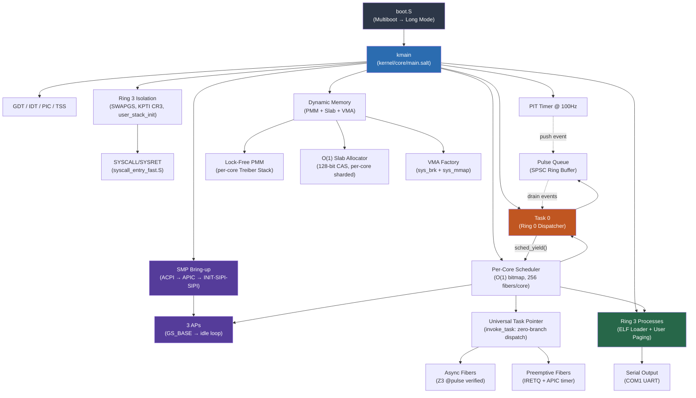

# Lattice Kernel

**The bare-metal heart of the Lattice operating system.** Written entirely in [Salt](../README.md), verified by Z3, running on x86_64 QEMU.

## Quick Start

```bash
# One command — builds compiler, compiles kernel, boots in QEMU
./scripts/demo_lattice.sh
```

**Prerequisites:** LLVM (`llc`, `clang`), Rust toolchain, QEMU (`qemu-system-x86_64`)

```bash
# macOS
brew install llvm qemu
# Ensure llc/clang are on PATH:
export PATH="/opt/homebrew/opt/llvm/bin:$PATH"
```

## Expected Output

```
Y12Z789!X
LATTICE BOOT: Serial OK
LATTICE BOOT: GDT...
LATTICE BOOT: IDT...
LATTICE BOOT: PIT...
LATTICE BOOT: SMP...
 SMP BRING-UP TEST SUITE
[SMP] Booting 3 Application Processors
[SMP] AP 1 ALIVE! GS_BASE loaded.
[SMP] AP 1 entering scheduler...
[SMP] AP 2 ALIVE! GS_BASE loaded.
[SMP] AP 2 entering scheduler...
[SMP] AP 3 ALIVE! GS_BASE loaded.
[SMP] AP 3 entering scheduler...
[SMP] All 3 APs online
LATTICE BOOT: CPUs online: 4
LATTICE BOOT: Scheduler...
LATTICE BOOT: PMM...
LATTICE BOOT: Slab Cache...
LATTICE BOOT: VMA...
LATTICE BOOT: Per-Core Tests...
LATTICE BOOT: Async Fiber Tests...
 ASYNC FIBER TEST SUITE
TEST:async:poll_pending_is_zero:PASS
TEST:async:spawn_slot_valid:PASS
TEST:async:step_ready_immediate:PASS
TEST:async:step_pending_count:PASS
 ASYNC FIBER TESTS COMPLETE
LATTICE BOOT: Preemptive Unification Tests...
 PREEMPTIVE UNIFICATION TEST SUITE
TEST:preempt:ipt_resolves:PASS
TEST:preempt:rip_correct:PASS
TEST:preempt:cs_correct:PASS
TEST:preempt:direct_poll_ready:PASS
TEST:preempt:task_poll_ready:PASS
TEST:preempt:fiber_executed:PASS
 PREEMPTIVE UNIFICATION TESTS COMPLETE

LATTICE KERNEL BOOT [OK]
[SMP] APs released
[Lattice] PREEMPTIVE MODE
RING3 IRETQ FRAME TEST SUITE
TEST:ring3:iretq_frame:ALL_PASS
RING3 KPTI TEST SUITE
TEST:ring3:kpti:ALL_PASS
RING3 E2E TEST SUITE
TEST:ring3:e2e:exit_code=42
TEST:ring3:e2e:ALL_PASS
BENCHMARK SUITE BEGIN
...
BENCHMARK SUITE COMPLETE
```

The `Y12Z789!X` prefix is diagnostic output from the bootloader confirming successful 32-bit → 64-bit Long Mode transition.

## Architecture



## Component Structure

| Directory | Role | Key Invariant |
|-----------|------|---------------|
| [`core/`](./core) | Scheduler, PMM, syscalls, dispatcher, per-CPU, process mgmt, Universal Task Pointer, Ring 3 TDD (ring3_test.salt) | **Zero-Branch Dispatch:** `invoke_task(step_fn, ctx)` for all fiber types. **Async:** Z3 `@pulse` verified. **Preemptive:** IRETQ + APIC timer. **Ring 3:** SWAPGS + KPTI CR3 (GS:[64]). |
| [`arch/`](./arch) | x86_64 boot, GDT/TSS, IDT, ISRs, SMP, SYSCALL fast path (SWAPGS), preempt_stub (user_stack_init) | **4-Core SMP:** Sequential AP handshake with GS_BASE per-CPU data. **Preemptive ABI:** `invoke_preemptive_thread` + `preempt_return_to_scheduler`. **Ring 3:** `user_stack_init` (SS=0x23, CS=0x2B). |
| [`drivers/`](./drivers) | Serial (UART), VirtIO-Net | **Isolation:** Drivers cannot corrupt kernel state |
| [`mem/`](./mem) | Slab allocator (128-bit CAS), user paging, VMA, mm_layout | **O(1):** Bump allocation, zero free cost |
| [`net/`](./net) | Ethernet, IP, UDP, ARP, **NetD bridges** (RX/TX SPSC), ARP cache (256-entry LRU), TCP connection manager (1024 TCBs), TCP parser + RFC 793 checksum | **Zero-copy:** Ring 3 data plane. Kernel is immune to packet-parsing RCE. |
| [`lib/`](./lib) | SPSC ring buffer (ipc_shm) | **Lock-free:** Single-producer single-consumer queue |
| [`../user/`](../user) | **Socket API** (socket.salt, socket_protocol.salt), **NetD** (netd.salt), syscall bindings | **Zero-trap data plane:** `read()`/`write()` are pure shared-memory SPSC ops. Control plane (bind/accept/close) via IPC. |

## Verified Kernel Primitives

Salt's Z3 theorem prover verifies memory safety contracts **at compile time**:

```salt
// PMM: Callers must provide a valid memory range
pub fn init(start: u64, end: u64)
    requires(start < end)
{ ... }

// Region allocator: Zero-byte allocations are a compile error
pub fn alloc(size: u64) -> u64
    requires(size > 0)
{ ... }
```

These contracts are checked by Z3 at every call site — if any caller could violate the precondition, the code **does not compile**.

The `@pulse` verifier extends this to async functions: every path through a state machine must reach a yield point within a cycle budget. Unbounded loops without yields are rejected at compile time.

## Performance (KVM — Intel Xeon 8151, Feb 2026)

| Metric | Result | Notes |
|--------|--------|-------|
| **Arena Alloc** | 59 cycles (~15 ns) | Bump pointer, L1 cache resident |
| **PMM Alloc/Free** | 73 cycles (~18 ns) | Lock-free CAS (Treiber stack) |
| **UTP invoke_task** | 29 cycles (~7 ns) | Zero-branch dispatch to any fiber type |
| **UTP Async Yield** | 111 cycles (~28 ns) | Full cooperative sched_yield round-trip |
| **UTP Spawn (async)** | 99 cycles (~25 ns) | Bitmap scan + slab alloc + frame init |
| **UTP Spawn (preempt)** | 116 cycles (~29 ns) | + IRETQ frame setup |
| **UTP Preempt Dispatch** | 430 cycles (~108 ns) | Full IRETQ chain with GPR save/restore |
| **IPC Ping-Pong** | 297 cycles (~74 ns) | Fiber-to-fiber zero-copy yield |
| **Context Switch** | 487 cycles (~122 ns) | Full GPR + 512B FXSAVE/FXRSTOR |
| **Slab Alloc** | O(1) | Treiber stack with `lock cmpxchgq` |
| **SIP IPC Ring** | 188 cycles (~47 ns) | 4-SPSC mailbox token pass (2.1× faster than seL4) |
| **NetD RX throughput** | ~43 cy/pkt (KVM est.) | SPSC bridge push+pop, 47B UDP frame |
| **NetD TX throughput** | ~46 cy/pkt (KVM est.) | SPSC bridge push+drain, 47B UDP frame |
| **NetD C10M PPS** | ~60M+ PPS (KVM est.) | **6× C10M threshold** (10M PPS) |
| **Socket Data Plane** | 136 cycles (~45 ns) | 64-byte push+pop round-trip, zero kernel traps |
| **Socket Throughput** | 22M ops/sec | Data plane read+write at 3.0 GHz |

See [LATTICE_BENCHMARKS.md](../docs/LATTICE_BENCHMARKS.md) for full methodology.

## Build System

The kernel build uses `tools/runner_qemu.py`:

```bash
# Build only (compile all .salt + .S → kernel.elf)
python3 tools/runner_qemu.py build

# Build + boot in QEMU with benchmark
python3 tools/runner_qemu.py run
```

### Compilation Pipeline

```
kernel/**/*.salt  →  salt-front  →  MLIR  →  salt-opt  →  LLVM IR  →  llc  →  .o
kernel/**/*.S     →  clang       →  .o
                                     ↓
                              rust-lld  →  kernel.elf  →  QEMU
```

> [!IMPORTANT]
> **Zero-Panic Policy:** The kernel must never panic without diagnostic output. All panics print a status code and context message to serial before halting.
