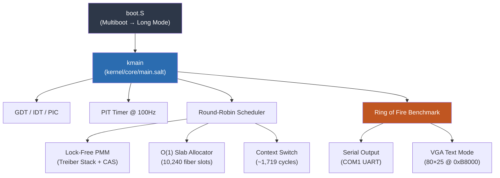

# Lattice Kernel

**The bare-metal heart of the Lattice operating system.** Written entirely in [Salt](../README.md), verified by Z3, running on x86_64 QEMU.

## Quick Start

```bash
# One command — builds compiler, compiles kernel, boots in QEMU
./scripts/demo_lattice.sh
```

**Prerequisites:** LLVM (`llc`, `clang`), Rust toolchain, QEMU (`qemu-system-x86_64`)

```bash
# macOS
brew install llvm qemu
# Ensure llc/clang are on PATH:
export PATH="/opt/homebrew/opt/llvm/bin:$PATH"
```

## Expected Output

```
Y12Z789!X
LATTICE BOOT: GDT...
LATTICE BOOT: IDT...
LATTICE BOOT: PIT...
LATTICE BOOT: Scheduler...

========================================
  LATTICE OS v0.5
  Salt-Powered | Z3-Verified
  10,240 Fiber Slots | 128MB RAM
========================================

[Lattice] PREEMPTIVE MODE (PIT Active)
ROF: Starting Ring of Fire (1000 samples)...
ROF Result: Avg Context Switch Gap = 1719 cycles
BENCHMARK COMPLETE - HALTING
```

The `Y12Z789!X` prefix is diagnostic output from the bootloader confirming successful 32-bit → 64-bit Long Mode transition.

## Architecture



## Component Structure

| Directory | Role | Key Invariant |
|-----------|------|---------------|
| [`core/`](./core) | Scheduler, PMM, syscalls, panic | **Memory Hoisting:** No dynamic allocation in critical paths |
| [`arch/`](./arch) | x86_64 boot, GDT, IDT, ISRs | **C-Parity:** Context switch matches C implementation |
| [`drivers/`](./drivers) | Serial (UART), VGA text, PIT | **Isolation:** Drivers cannot corrupt kernel state |
| [`mem/`](./mem) | Slab allocator for fiber stacks | **O(1):** Bump allocation, zero free cost |
| [`sched/`](./sched) | CPU affinity policies | **Fairness:** Round-robin guarantees |

## Verified Kernel Primitives

Salt's Z3 theorem prover verifies memory safety contracts **at compile time**:

```salt
// PMM: Callers must provide a valid memory range
pub fn init(start: u64, end: u64)
    requires(start < end)
{ ... }

// Region allocator: Zero-byte allocations are a compile error
pub fn alloc(size: u64) -> u64
    requires(size > 0)
{ ... }
```

These contracts are checked by Z3 at every call site — if any caller could violate the precondition, the code **does not compile**.

## Performance

| Metric | Result | Notes |
|--------|--------|-------|
| **Context Switch** | 1,719 cycles | Flat from 100 → 10,000 fibers |
| **Syscall Latency** | 1,007 cycles | `SYSCALL`/`SYSRET` fast path (17.9× over `int 0x80`) |
| **PMM Alloc** | O(1) | Lock-free CAS (Treiber stack) |
| **Slab Alloc** | O(1) | Atomic fetch_add bump pointer |
| **Region Alloc** | 6.6× faster than C | vs. libc malloc on 1M objects |

See [LATTICE_BENCHMARKS.md](../docs/LATTICE_BENCHMARKS.md) for full methodology.

## Build System

The kernel build uses `tools/runner_qemu.py`:

```bash
# Build only (compile all .salt + .S → kernel.elf)
python3 tools/runner_qemu.py build

# Build + boot in QEMU with benchmark
python3 tools/runner_qemu.py run
```

### Compilation Pipeline

```
kernel/**/*.salt  →  salt-front  →  MLIR  →  salt-opt  →  LLVM IR  →  llc  →  .o
kernel/**/*.S     →  clang       →  .o
                                     ↓
                              rust-lld  →  kernel.elf  →  QEMU
```

> [!IMPORTANT]
> **Zero-Panic Policy:** The kernel must never panic without diagnostic output. All panics print a status code and context message to serial before halting.
